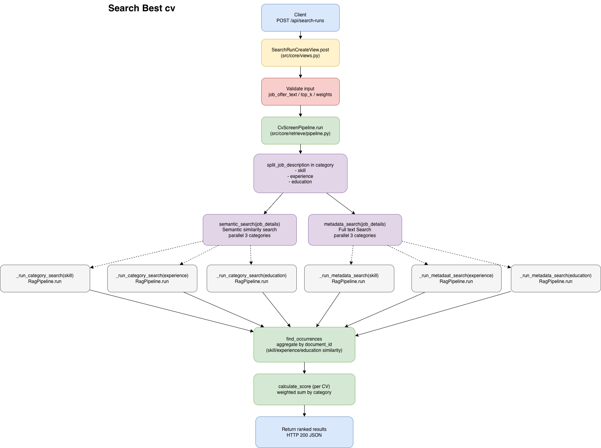
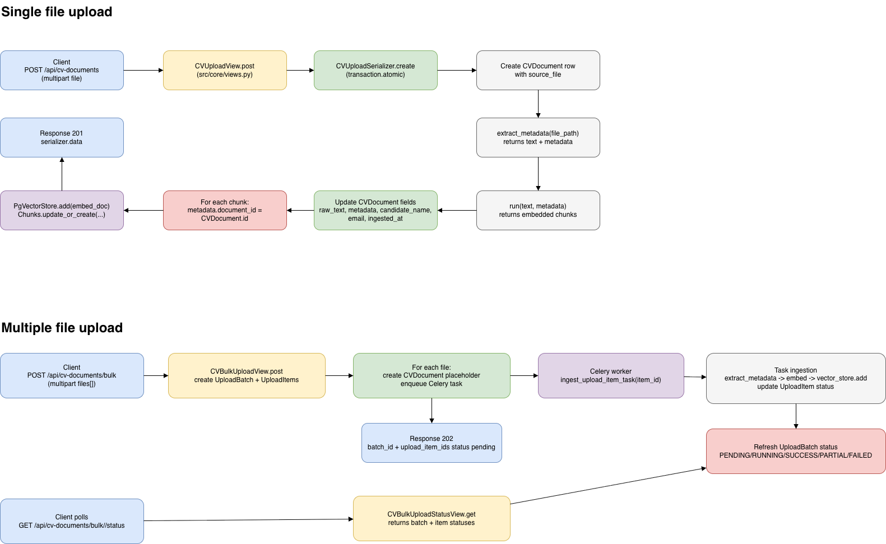

<div align="center">

# match-cv

**CV ingestion and matching service built with Django, pgvector, Datapizza pipelines, and Celery**

Scoring uses category weights: `skill`, `experience`, `education`.
The API requires all three and they must sum to `1.0` (example: `0.4 + 0.4 + 0.2`).
Higher weight means stronger impact on the final ranking.

[](https://www.python.org/downloads/)
[](https://www.djangoproject.com/)
[](https://docs.celeryq.dev/)
[](https://docs.astral.sh/ruff/)

[🚀 Quick Start](#-quick-start-local) • [🔌 API](#-api-endpoints) • [🏗️ Architecture](#-architecture-overview) • [🧪 Testing](#-testing) • [📝 Notes](#-notes)

</div>

---

## ⚙️ Requirements

- Python `3.13+`
- `uv`
- Docker (recommended for PostgreSQL + Redis)

## 🚀 Quick Start (Local)

1. Create and activate virtualenv.

```bash
uv venv
source .venv/bin/activate
```

2. Install dependencies.

```bash
uv sync
```

3. Create local env file from template.

```bash
cp .env.example .env
```

4. Configure environment variables in `.env`.

```bash
OPENAI_API_KEY=your_key
EMBEDDING_MODEL_NAME=text-embedding-3-small
```

5. Start infrastructure.

```bash
docker compose up -d
```

6. Run migrations.

```bash
python manage.py migrate
```

7. Start Django API.

```bash
python manage.py runserver
```

8. Start Celery worker (new terminal).

```bash
celery -A src.config.celery worker -l info
```

## 🧪 Testing

Run tests:

```bash
pytest
```

Run tests with coverage:

```bash
pytest --cov --cov-report=html
```

## 🎨 Formatting

```bash
ruff format --config ./ruff.toml .
```

## 🔌 API Endpoints

Base prefix: `/api/`

### 1. Upload single CV

- Method: `POST /api/cv-documents/`
- Content-Type: `multipart/form-data`
- File field: `source_file`

Example:

```bash
curl -X POST http://127.0.0.1:8000/api/cv-documents/ \
  -F "source_file=@/absolute/path/cv.pdf"
```

Responses:
- `201` document created and ingested synchronously
- `400` validation error

### 2. Bulk upload CVs (async)

- Method: `POST /api/cv-documents/bulk/`
- Content-Type: `multipart/form-data`
- File field: repeated `files`

Example:

```bash
curl -X POST http://127.0.0.1:8000/api/cv-documents/bulk/ \
  -F "files=@/absolute/path/cv1.pdf" \
  -F "files=@/absolute/path/cv2.pdf"
```

Responses:
- `202` returns `batch_id` and `upload_item_id` list
- `400` invalid multipart payload

### 3. Bulk upload batch status

- Method: `GET /api/cv-documents/bulk/<batch_id>/status/`

Response contains:
- batch status (`PENDING|RUNNING|SUCCESS|FAILED|PARTIAL`)
- counters (`total_files`, `processed_files`, `failed_files`)
- per-item status and `error_message`

### 4. Run matching pipeline

- Method: `POST /api/search-runs/`
- Content-Type: `application/json`

Example payload:

```json
{
  "job_offer_text": "Looking for backend engineer with Python and 5+ years",
  "weights": {
    "skill": 0.1,
    "experience": 0.7,
    "education": 0.2
  },
  "top_k": 10
}
```

Responses:
- `200` ranked candidate list
- `400` request validation error
- `500` pipeline/runtime error

## 🏗️ Architecture Overview

### Search flow

Split job offer (`skill`, `experience`, `education`) -> parallel category retrieval for semantic search and full text search on metadata -> merge by document -> weighted scoring.



### Upload flow

- Single upload: API -> serializer -> metadata extraction -> embedding -> vector store write
- Bulk upload: API creates batch/items -> Celery task per item -> status polling endpoint



## 📝 Notes

- CV upload endpoints require multipart file upload; JSON file paths are not accepted.
- If Celery worker is not running, bulk upload items remain in `PENDING`.
- Vector metadata must be JSON-serializable; UUID handling is normalized in vector store code.
